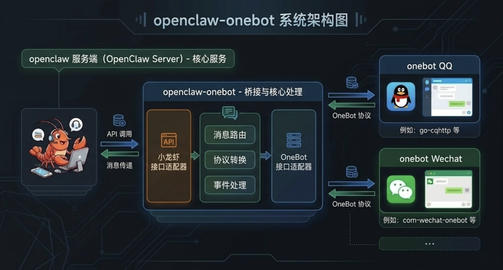

<div align="center">

# openclaw-onebot

[OpenClaw](https://openclaw.ai)  的 **OneBot v11 协议**（QQ/Lagrange.Core、go-cqhttp 等）渠道插件。

[](https://www.npmjs.com/package/@kirigaya/openclaw-onebot)
[](https://github.com/LSTM-Kirigaya/openclaw-onebot)
[](LICENSE)
[](https://nodejs.org)
[](https://www.typescriptlang.org/)
[](https://openclaw.ai)

</div>

---

## 安装

```bash
openclaw plugins install @kirigaya/openclaw-onebot
openclaw onebot setup
```

## 教程

[让 QQ 接入 openclaw！让你的助手掌管千人大群](https://kirigaya.cn/blog/article?seq=368)




## 功能

- ✅ 私聊：所有消息 AI 都会回复
- ✅ 触发：支持 @触发 和关键词触发**同时生效**，任一命中即响应
- ✅ 自动获取上下文
- ✅ 自定义新成员入群欢迎触发器
- ✅ 自动合并转发长消息：超过阈值可渲染为图片发送或者合并发送
- ✅ 支持文件，图像读取/发送
- ✅ 支持黑白名单系统

## 安装 onebot 服务端

你需要安装 onebot 服务端，QQ 目前比较常用的是 onebot 服务端是 NapCat，可以查看 [官网](https://napneko.github.io/) 了解安装方法


### 连接类型

| 类型 | 说明 |
|------|------|
| `forward-websocket` | 插件主动连接 OneBot（go-cqhttp、Lagrange.Core 正向 WS/WSS） |
| `backward-websocket` | 插件作为服务端，OneBot 连接过来 |

> 💡 **提示**：支持 `ws://` 和 `wss://`（WebSocket Secure）协议，可填写完整 URL 如 `wss://ws-napcatqq.example.com`

### 环境变量

可替代配置文件，适用于 Lagrange 等：

| 变量 | 说明 |
|------|------|
| `ONEBOT_WS_TYPE` | forward-websocket / backward-websocket |
| `ONEBOT_WS_HOST` | 主机地址 |
| `ONEBOT_WS_PORT` | 端口 |
| `ONEBOT_WS_ACCESS_TOKEN` | 访问令牌 |

## 使用

1. 安装并配置
2. 重启 Gateway：`openclaw gateway restart`
3. 在 QQ 私聊或群聊中发消息（群聊需 @ 机器人，或配置关键字触发）

## 触发方式

群聊中支持两种触发方式，**可同时生效**，任一命中即触发回复：

| 触发方式 | 说明 |
|----------|------|
| **@提及** | 在群聊中 @ 机器人，默认开启 |
| **关键词** | 消息包含（或以之开头）指定关键词时触发 |

### 配置关键词触发

在 `openclaw.json` 中配置 `triggerKeywords` 数组即可启用关键词触发，**无需关闭 @触发**：

```json
{
  "channels": {
    "onebot": {
      "triggerKeywords": ["AI", "助手", "帮我问"],
      "triggerMode": "contains"
    }
  }
}
```

| 配置项 | 说明 |
|--------|------|
| `triggerKeywords` | 关键词列表，包含任一关键词即触发 |
| `triggerMode` | 匹配模式：`"prefix"`（消息以关键词开头，默认）或 `"contains"`（消息包含关键词即可） |

### 触发逻辑总结

| `triggerKeywords` | `requireMention` | 触发行为 |
|-------------------|------------------|----------|
| 已配置 | `true`（默认） | **@ 或关键词**任一命中即触发 |
| 已配置 | `false` | **@ 或关键词**任一命中即触发 |
| 未配置 | `true`（默认） | 仅 @ 触发 |
| 未配置 | `false` | 所有群消息都触发 |

> 💡 以上所有场景中，若配置了 `randomReplyProbability`，即使未命中任何触发条件，也会按概率随机回复。

### 随机回复

当群消息既没有被 @ 也没有匹配关键词时，可以按照配置的概率随机触发回复，让机器人偶尔主动参与群聊：

```json
{
  "channels": {
    "onebot": {
      "randomReplyProbability": 0.05
    }
  }
}
```

| 配置项 | 说明 |
|--------|------|
| `randomReplyProbability` | 随机回复概率，`0`\~`1` 之间的小数。默认 `0`（不启用）。`0.05` 表示 5% 概率，`0.1` 表示 10% 概率 |

## 长消息处理与 OG 图片渲染

当单次回复超过**长消息阈值**（默认 300 字）时，可选用三种模式（`openclaw onebot setup` 中配置）：

| 模式 | 说明 |
|------|------|
| `normal` | 准流式分段发送：边生成边聚合，按时间窗口或长度阈值增量发送 |
| `og_image` | 将 Markdown 转为 HTML 再生成图片发送（需安装 `satori` 和 `sharp`） |
| `forward` | 合并转发（发给自己后打包转发） |

`normal` 模式默认会开启块流式接收，并在插件侧做短时间聚合，默认规则：

- `normalModeFlushIntervalMs`: `1200`
- `normalModeFlushChars`: `160`

也就是回复不会逐 token 刷屏，而是大约每 1.2 秒或累计到 160 字左右就发送一段。可在 `openclaw.json` 中手动调整：

```json
{
  "channels": {
    "onebot": {
      "longMessageMode": "normal",
      "normalModeFlushIntervalMs": 1200,
      "normalModeFlushChars": 160
    }
  }
}
```

选择 **生成图片发送（og_image）** 时，会额外询问**渲染主题**：

| 选项 | 说明 |
|------|------|
| **default** | 无额外样式，默认白底黑字 |
| **dust** | 内置主题：暖色、旧纸质感 |
| **custom** | 自定义：在 `ogImageRenderThemePath` 中填写 CSS 文件绝对路径 |

配置项（枚举 + 可选路径）：

- `ogImageRenderTheme`：`"default"` | `"dust"` | `"custom"`
- `ogImageRenderThemePath`：当为 `custom` 时必填，CSS 文件绝对路径

示例（`openclaw.json`）：

```json
{
  "channels": {
    "onebot": {
      "longMessageMode": "og_image",
      "longMessageThreshold": 300,
      "ogImageRenderTheme": "dust"
    }
  }
}
```

自定义主题示例：

```json
{
  "channels": {
    "onebot": {
      "longMessageMode": "og_image",
      "ogImageRenderTheme": "custom",
      "ogImageRenderThemePath": "C:/path/to/your-theme.css"
    }
  }
}
```

## 主动发送消息

通过 `openclaw message send` CLI（无需 Agent 工具）：

```bash
# 发送文本
openclaw message send --channel onebot --target user:123456789 --message "你好"

# 发送图片
openclaw message send --channel onebot --target group:987654321 --media "file:///path/to/image.png"
```

`--target` 格式：`user:QQ号` 或 `group:群号`。回复场景由 deliver 自动投递，Agent 输出 text/mediaUrl 即会送达。

## 新成员入群欢迎（自定义图片）

当有新成员加入群时，可根据其 ID 信息生成欢迎图片并发送。详见 [receive.md](skills/onebot-ops/receive.md#新成员入群欢迎)。

1. 在 `openclaw.json` 中配置：

```json
{
  "channels": {
    "onebot": {
      "groupIncrease": {
        "enabled": true,
        "command": "npx tsx src/openclaw/trigger/welcome.ts",
        "cwd": "C:/path/to/Tiphareth"
      }
    }
  }
}
```

2. `command` 在 `cwd` 下用系统 shell 执行，环境变量传入 `GROUP_ID`、`GROUP_NAME`、`USER_ID`、`USER_NAME`、`AVATAR_URL`。命令可调用 `openclaw message send` 自行发送，或向 stdout 输出 JSON 行供 handler 发送。

3. 测试：`npm run test:group-increase-handler`（DRY_RUN 模式，仅生成图片）

## 回复白名单

默认为空回复所有人的消息。如果设置的话，那么机器人就只会回复设置的数组里的用户的消息。

```json
{
  "channels": {
    "onebot": {
      "whitelistUserIds": [1193466151]
    }
  }
}
```

## 黑名单

在群里有时候有些人需要被屏蔽，不管他怎么 @ 还是怎么，都屏蔽他的消息不触发。

```json
{
  "channels": {
    "onebot": {
      "blacklistUserIds": [123456789]
    }
  }
}
```

**注意**：白名单优先级高于黑名单。如果同时设置了白名单和黑名单，只有白名单内的用户才能触发，且黑名单内的白名单用户也会被屏蔽。

## 新人入群触发器

如果有人入群之后，可以通过这个来实现触发器。

```json
{
  "channels": {
    "onebot": {
      "groupIncrease": {
        "enabled": true,
        "command": "npx tsx welcome.ts",
        "cwd": "/path/to/triggers"
      }
    }
  }
}
```

实现的脚本必须支持这三个参数：

```
--userId ${userId} --username ${username} --groupId ${groupId}
```

## 测试

### 测试连接

项目内提供测试脚本（需 `.env` 或环境变量）：

```bash
cd openclaw-onebot
npm run test:connect
```

### 测试 OG 图片渲染效果

用于预览「Markdown 转图片」在不同主题下的渲染效果（需安装 `satori` 和 `sharp`）：

```bash
cd openclaw-onebot
# 无额外样式
npm run test:render-og-image -- default
# 内置 dust 主题
npm run test:render-og-image -- dust
# 自定义 CSS 文件（绝对路径）
npm run test:render-og-image -- "C:/path/to/your-theme.css"
```

生成图片保存在 `test/output-render-<主题>.png`，可直接打开查看。

## 参考

- [OneBot 11](https://github.com/botuniverse/onebot-11)
- [go-cqhttp](https://docs.go-cqhttp.org/)
- [Lagrange.Core](https://github.com/LSTM-Kirigaya/Lagrange.Core)
- [NapCat](https://github.com/NapNeko/NapCatQQ)

## Debug 文件日志

当群聊触发了但没有回复时，可以开启文件日志排查问题。日志独立于 Gateway 控制台输出，直接写入文件：

```json
{
  "channels": {
    "onebot": {
      "debugLog": true,
      "debugLogPath": "~/.openclaw/logs/onebot-debug.log",
      "debugLogMaxSizeMB": 10
    }
  }
}
```

| 配置项 | 说明 |
|--------|------|
| `debugLog` | 是否启用文件日志，默认 `false` |
| `debugLogPath` | 日志文件路径，默认 `~/.openclaw/logs/onebot-debug.log` |
| `debugLogMaxSizeMB` | 单文件最大 MB，超出后轮转为 `.log.1`，默认 `10` |

日志覆盖的关键路径：
- 消息接收与触发检查（@提及 / 关键词 / 跳过原因）
- 白名单 / 黑名单拦截
- 自消息检测（`user_id === self_id`）
- Agent 回复 NO_REPLY 导致的静默丢弃
- 每条消息的发送结果（成功 / 失败 / 无有效目标）
- dispatch 异常与超时（未收到 final 帧）
- forward 模式合并转发降级

## 联系

zhelonghuang@qq.com

要是我不回你，可以选择进我的QQ群。782833642

## License

MIT © [LSTM-Kirigaya](https://github.com/LSTM-Kirigaya)
